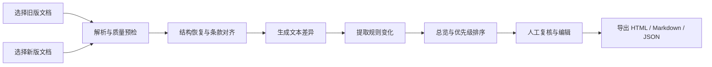
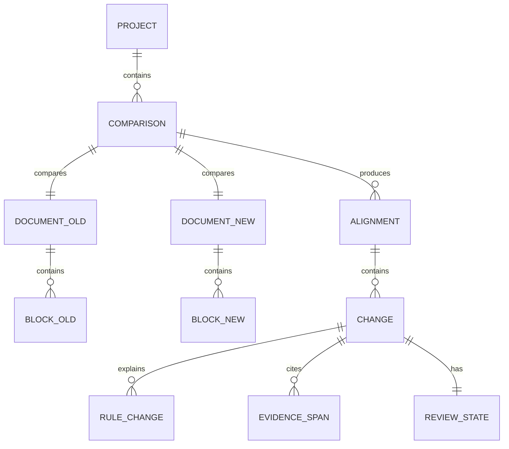
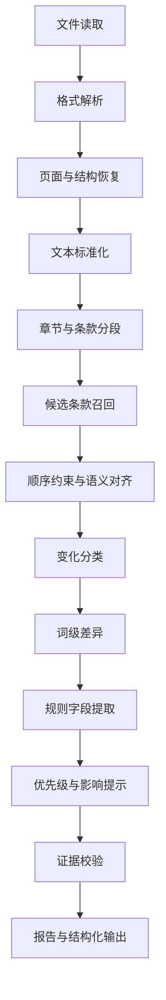

# GovernDiff 产品需求文档（PRD）

> Open-source breaking-change detection and CI for policies, regulations, bylaws, and organizational rules.

| 项目 | 内容 |
|---|---|
| 产品暂定名 | GovernDiff |
| 文档版本 | v0.6 |
| 文档状态 | Draft / 可进入原型与技术评审 |
| 更新日期 | 2026-08-11 |
| 目标阶段 | 公开 Beta |
| 建议周期 | 2 周 Discovery + 8–10 周开发，1–3 人小团队 |
| 首发平台 | CLI、GitHub Action、本地审查 Web 应用 |
| 首发语言 | 简体中文、英文 |

---

## 0.1 v0.2 可运行切片状态（2026-08-04）

本轮已把两个 P0 重点从 PRD 要求推进为可运行实现：

1. **置信度分层**：每个 change 与 finding 都输出 `confidence_score`、`confidence_level` 和 `confidence_reasons`；固定阈值为 high ≥ 0.80、medium ≥ 0.62、其余为 low。CI 使用“严重度 × 最低置信度”双门槛，低置信度结果仍保留供人工复核。
2. **条号重映射**：支持 `Article 7A`、`Section 2.1` 与中文数字条号；根据已对齐条款的数量、平均相似度和竞争目标差距推断一对一旧条号→新条号映射，并生成非 Breaking 的 `article-remapped` 审计项。
3. **GitHub Action**：根目录 `action.yml` 自动比较 PR base 与命中 path/glob 的实际变化，显式处理新增/删除文件，为每个文件生成 JSON/Markdown/HTML/CSV、紧凑 Job Summary、源码行 annotation、完整 artifact 链接与可配置门禁输出。
4. **Reviewer UI**：`reviewer-ui/` 可导入任意 GovernDiff JSON，按置信度、Breaking 和审阅状态筛选，展示新旧证据与条号映射，并将审阅决定保存在浏览器后导出。

当前 schema 为 `1.1`，生成器版本为 `governdiff/0.2.0`。上述实现不改变“结论是审查线索而非法律判断”的准确性边界。

## 0.2 v0.3 P0 文档输入状态（2026-08-04）

第二阶段已完成 PDF、DOCX、HTML、Markdown、TXT 五种输入的统一证据模型：
数字版 PDF 保留物理页码，DOCX 保留段落索引并解析标题、列表和表格，HTML
恢复正文层级并去除站点噪声；DOCX/HTML 表格单元格以标准行列坐标参与 diff。
新增独立 `preflight` 命令，覆盖空文件、损坏/加密文件、乱码、低文本覆盖率、
空白页、疑似扫描件以及 25MB/300 页限制。所有错误说明原因、影响和下一步。

OCR 明确不在 v0.3 范围内：纯图像 PDF 返回可操作错误，混合型 PDF 返回警告，
系统不会本地或远程调用 OCR。当前 schema 为 `1.2`，生成器版本为
`governdiff/0.3.0`。结项证据见 `docs/PHASE_2_COMPLETION.zh-CN.md`。

## 0.3 v0.4 差异与条款对齐状态（2026-08-09）

第三阶段完成原生一对多拆分、多对一合并、双语词级 Diff、条号候选竞争、
中英文交叉引用变化和结构化时间字段。报告同时保留单数兼容字段与复数证据块，
新增章节树统计，schema 升级为 `1.3`，生成器版本为 `governdiff/0.4.0`。

Reviewer UI 可按章节与变化类型筛选，显示词级增删替换和条号映射候选；人工可
解除自动匹配，使用稳定 block ID 建立一对一、一对多或多对一重连，并将决定保存
在浏览器及导出到 `governdiff-review.json`。结项证据见
`docs/PHASE_3_COMPLETION.zh-CN.md`。

## 0.4 v0.5 Reviewer 审阅闭环状态（2026-08-09）

第四阶段完成审阅数据从机器报告到人工决定、再回到 CLI 报告的闭环。报告 schema
升级为 `1.4`，审阅状态统一为 `unreviewed`、`confirmed`、`rejected`、
`modified`、`waived`；人工编辑 actor、deadline、scope 等提取字段时，报告同时
保留机器值、人工值和最终有效值。Reviewer 导出的 `governdiff-review/1.1` 可由
CLI 的 `--review` 重新导入，决定、备注、字段修正和人工条款重连都会影响报告。

Reviewer 同时支持批量确认/驳回、隐藏格式变化、直接生成豁免条目、常驻质量警告、
一键清除本地项目，以及键盘、焦点、读屏和非颜色唯一表达。第四阶段结项证据见
`docs/PHASE_4_COMPLETION.zh-CN.md`。自包含 HTML、导出范围、完整报告 JSON Schema、
CSV 和脱敏导出仍属于第五阶段，本轮没有提前标记完成。

## 0.5 v0.6 报告契约与公开 Schema 状态（2026-08-11）

第五阶段完成统一报告选择模型，JSON、Markdown、自包含 HTML 和 CSV 共用
`all / breaking / confirmed / unreviewed / filtered` 范围语义。CLI 可生成无需
服务器和外部资源的 HTML；CSV 保持一行一个 finding；四种格式均包含生成器、
生成时间、完整文档 SHA-256、选择范围和非法律意见声明。脱敏模式删除完整 block、
表格内容并限制证据和值的长度。

报告 schema 升级为 `1.5`，生成器版本为 `governdiff/0.6.0`。仓库正式发布
report 1.5、review 1.1 和 waiver 1.0 schema、示例及兼容策略。waiver 规范字段为
`approved_by / created_at / expires_at`；过期项自动失效并进入报告诊断。结项证据见
`docs/PHASE_5_COMPLETION.zh-CN.md`。Phase 6 的本地生产化实现与 GitHub-hosted canary
已完成，证据见 `docs/PHASE_6_COMPLETION.zh-CN.md`；正式远端 run 与 release tag 随
Phase 8 建立初始历史后发布。Phase 7 的隐私、性能与供应链门禁已在工作区完成，结项
证据见 `docs/PHASE_7_COMPLETION.zh-CN.md`；由于尚无远端，三平台 hosted run URL 随
Phase 8 发布时产生。Phase 8 除发布外的本地前置任务已于 2026-08-13 完成，证据见
`docs/PHASE_8_PRE_RELEASE_COMPLETION.zh-CN.md`；历史整理、remote、hosted CI、tag、
PyPI、GitHub Release 和公开部署尚未执行。Phase 9 尚未开始，OCR 仍不在当前实现范围。

## 0.6 v0.6 发布范围裁决（2026-08-14）

本节是 v0.6 发布验收的唯一范围权威。后文完整 PRD 保留产品长期蓝图与历史 P0/P1
定义，但不能单独解释为 v0.6 已承诺能力。逐项实现、测试、证据与处置见
`docs/REQUIREMENTS_TRACEABILITY_MATRIX.zh-CN.md`。

v0.6 发布候选包含：本地 Python CLI、五种数字文本格式、确定性差异与 15 个首版
Breaking Checks、版本化报告/审阅/豁免契约、文件化配置与门禁、wheel 内置的
loopback Reviewer，以及仓库内 GitHub composite Action。Reviewer 的正式入口是
`governdiff review OLD NEW`，不是后文早期蓝图中的 `govdiff serve`。

以下能力明确不属于 v0.6：URL 导入、OCR、Local/Remote AI、比较结果缓存、在线账户、
遥测、云端文档处理、公共 Reviewer 部署，以及 PR 页面内直接逐项写回复。交换新旧文件
的一键 UI 和自定义优先级规则延后到 v0.7；Docker 不是 v0.6 支持安装方式。远端
GitHub-hosted 运行、tag、PyPI、GitHub Release 与公开部署属于发布阶段动作，只能在
单独授权后执行，不能用本地模拟结果替代。

本轮真实用户测试经产品负责人明确延期，因此不得把它记为通过。其结果是 Public Beta
Go 条件仍未满足，但不否定本地候选的技术验收。凡本节与后文历史路线或优先级冲突，
以本节和 RTM 的 v0.6 处置为准。

## 1. 产品摘要

GovernDiff 是一个面向自然语言政策、法规、章程、管理制度和 SOP 的开源 Breaking Change 检测器与 Policy CI。用户提供两个版本的文档，系统在保留原始页码、章节和文本证据的前提下，识别：

- 哪些条款被新增、删除、修改、移动、拆分或合并；
- 哪些规则要素发生变化，例如适用对象、义务、权限、条件、数值、期限和例外；
- 哪些利益相关者可能受到影响；
- 哪些变化值得人工优先复核；
- 每一项结论对应哪一段原文。

产品的核心不是“替用户阅读文档”，也不是再做一个商业文档红线工具，而是把人工、低效且容易遗漏的制度比较工作，转换成结构化、可追溯、可复核、可配置，并能进入 Pull Request 和 CI 的审查工作流。

### 1.1 一句话定位

> GovernDiff 是自然语言政策与组织规则的 `oasdiff`：发现可能影响政策使用者的 Breaking Changes，并在合并前要求审查。

### 1.2 核心产品承诺

用户应当能够在 5 分钟内完成第一次比较，并回答三个问题：

1. 发生了什么变化？
2. 哪些变化可能重要？
3. 系统为什么得出这个结论？

### 1.3 首发楔子

GovernDiff 首发不以“比较任意两个文件”为主要传播点，而以以下场景切入：

> 当 `GOVERNANCE.md`、`SECURITY.md`、隐私政策、员工制度、研究规范或组织 SOP 在 Git 中发生变化时，自动指出义务、权限、范围、期限、门槛和例外是否发生实质变化，并在合并前留下可审计的复核结果。

同一引擎仍支持用户临时比较 PDF 和 DOCX，但这是产品覆盖面，不是差异化定位。

### 1.4 产品形态

- **CLI**：核心入口，适合本地比较、批处理、研究复现和 CI。
- **GitHub Action**：首发关键能力，当仓库中的政策或治理文件变化时，在 Pull Request 中生成结构化报告。
- **本地审查 Web 应用**：v0.6 通过 `governdiff review OLD NEW` 启动，用于左右对照、确认、驳回、豁免和导出；文档默认不离开设备。`govdiff serve` 仅为早期蓝图，不是已发布命令。
- **在线演示**：首发只提供预置案例或明确告知上传策略，不作为私密文件的默认处理方式。

---

## 2. 背景与问题定义

### 2.1 当前工作方式

政策研究者、合规人员、管理人员和学术用户通常通过以下方式比较制度文档：

- 同时打开两个 PDF 或 Word 文件，逐页人工查看；
- 使用 Word 或普通文本 Diff，处理格式变化和段落顺序变化；
- 将文件交给通用大模型，要求总结差异；
- 在 Excel 中手工登记条款、变化类型和影响对象；
- 依赖个人记忆确认旧规则是否已经被替代。

### 2.2 主要痛点

#### P1：普通文本 Diff 不理解文档结构

段落移动、编号变化、页眉页脚、目录更新和换行差异会制造大量噪声。真正重要的一处规则变化可能淹没在数百处格式变化中。

#### P2：通用 AI 摘要难以核验

用户经常无法确认摘要是否遗漏、夸大或误解了条款。对于政策、合规和组织制度，不能只给出“看起来合理”的答案。

#### P3：变化没有被转换成规则语言

“这段文字变了”不等于“规则发生了什么变化”。用户真正关心的是主体、行为、条件、期限、金额、权限和例外是否改变。

#### P4：比较结果难以协作和复用

人工标注通常散落在 Word 批注、聊天记录和表格中，难以版本化、导出、审计或用于后续监测。

#### P5：私密文档不适合默认上传云端

企业制度、未公开政策草案、员工手册和内部 SOP 可能包含敏感信息，用户需要明确的本地处理能力。

### 2.3 产品机会

现有工具通常分别解决文本 Diff、PDF 问答、法律检索或文档管理，但缺少一个同时满足以下条件的轻量开源产品：

- 针对规则性文档进行结构化比较；
- 默认保留页码、章节和证据区间；
- 没有大模型也能完成基础比较；
- 支持本地运行和自动化集成；
- 面向多领域，而不是绑定某一国家或单一法规数据库。

### 2.4 立项前提验证结论

本项目必须同时通过两个立项门：

1. **需求门**：目标工作是否真实、高频且已有时间或付费成本；
2. **空缺门**：是否已有成熟产品完整解决了我们准备解决的问题。

截至 2026-08-03 的公开资料审计结论：

| 前提 | 结论 | 置信度 | 对 PRD 的影响 |
|---|---|---|---|
| 文档与监管变化比较确实有需求 | **通过** | 高 | 可继续立项，但需用真实文档访谈验证首发人群 |
| “智能比较两个政策文档”尚无人完成 | **不通过** | 高 | 商业产品和研究原型均已覆盖，不可用作独占定位 |
| “面向自然语言治理文档的开源 Policy CI”尚无成熟完整实现 | **暂时通过** | 中高 | 作为新的首发定位；在开发前继续进行竞品证伪 |

因此，原始方向被主动收窄：

```text
原定位：通用的政策/制度语义比较工具
    ↓ 竞品反证后收窄
新定位：自然语言政策的 Breaking Change 检测器 + GitHub Policy CI
```

这里的“暂时通过”不等于宣称全世界绝对不存在同类产品。公开检索无法证明绝对不存在，只能说明：在已审计的主要商业产品、活跃 GitHub 项目、2026 年研究成果和法规技术项目中，尚未找到一个同时覆盖本 PRD 完成标准的成熟实现。

### 2.5 需求存在的证据

#### 证据 A：学术界确认“字符 Diff 不足”是现实问题

2026 年 ACL 论文 *Fine-Grained Semantic Comparison of Legal Documents using LLMs* 明确指出：大型组织中的监管文档频繁修订，律师和审计人员很难手工发现不一致；现有字符级工具会遗漏改写和语义变化。论文为此发布了 LegDiff 基准和 SLeDoC 原型。这是对问题和技术缺口的直接研究验证。[ACL Anthology](https://aclanthology.org/2026.acl-srw.86/)

#### 证据 B：文档比较已经形成成熟付费市场

- Litera 自报其 Compare 产品被 72% 的法律市场和 98% 的 Am Law 100 使用，并提供 Word、PDF、Excel、PowerPoint、桌面、服务器和 AI 风险分析。这至少证明高准确度文档比较有强付费需求。[Litera Compare](https://www.litera.com/products/litera-compare)
- Draftable 同时提供免费在线版、付费离线桌面版、企业本地部署和 REST API，并把移动后编辑的文本识别作为相对 Word Compare 的卖点。这证明隐私、本地运行、多格式和移动识别都是实际采购维度。[Draftable](https://www.draftable.com/compare)
- KaleidoDocs 直接销售“过滤格式噪声，突出条款、数字、日期和义务变化”的产品，Pro 计划按月收费。它与 GovernDiff 原始产品承诺高度重合，是需求证据，也是必须正视的竞品。[KaleidoDocs](https://kaleidodocs.com/)

#### 证据 C：监管变化管理是独立软件类别

- Wolters Kluwer 的 OneSumX 将监管变化追踪、原始来源链接、影响评估、任务与审计轨迹作为完整产品能力，并称数据范围覆盖 700 多个监管机构。[OneSumX Regulatory Change Management](https://www.wolterskluwer.com/en/solutions/onesumx-for-compliance-program-management/onesumx-for-regulatory-change-management)
- Thomson Reuters 的 Regulatory Intelligence 提供 1,200 个监管机构、2,500 组监管和立法材料的追踪，并提供 API 和工作流集成。[Thomson Reuters Regulatory Intelligence](https://legal.thomsonreuters.com/en/risk-fraud-investigations/risk-compliance-management)
- Wolters Kluwer 引用的调查中，金融机构最主要的监管关注包括维持对变化法规的合规（56%）、跟踪监管变化（53%）以及向监管方证明合规（52%）。该数字来自供应商材料，应视为方向性证据而非中立市场规模研究。[Wolters Kluwer](https://www.wolterskluwer.com/en/expert-insights/leveraging-a-regulatory-change-data-feed-and-rcm-platform-to-maximize-compliance-confidence)

#### 证据 D：Policy CI 的产品形态在相邻领域已被验证

OASDiff 将结构化 API 规范的变化分为完整 Diff、Changelog 和 Breaking Changes，支持本地 CLI、GitHub Action、PR 审批、稳定变化指纹、来源定位和多种机器可读输出，截至审计时约 1.3k Stars。它不处理自然语言政策，但验证了“领域语义 Diff + CI + 人工审批”这一开源产品形态。[OASDiff](https://github.com/oasdiff/oasdiff)

#### 需求结论

广义需求已经得到学术、商业采购和开源相邻品类三类证据支持。仍需验证的不是“有人是否需要比较文档”，而是：

> GitHub 用户、开源治理团队和采用 Docs-as-Code 的合规团队，是否愿意把自然语言政策变化作为 CI 检查长期运行。

这一更窄问题必须通过真实用户试用验证，不能仅由上述市场证据代替。

### 2.6 最接近竞品审计

| 产品 | 已完成能力 | 与 GovernDiff 的关键差异 | 判断 |
|---|---|---|---|
| Litera Compare | 成熟多格式红线、桌面/服务器、AI 风险分析、法律工作流 | 闭源商业软件；面向法律文档生产力，不是开放的自然语言 Policy CI | 强替代品，但不是同一开源楔子 |
| Draftable | PDF/Word/PPT/Excel、移动识别、离线桌面、企业部署、API | 闭源；主要是精确红线，不提供开放规则本体、稳定政策变化指纹和 GitHub 审批流 | 强底层替代品 |
| KaleidoDocs | 上传两版 PDF、过滤噪声、解释日期/数字/义务等重要变化 | 闭源托管产品；未展示本地离线引擎、公开 schema、CLI、Action 或可配置 Breaking Checks | 与原始定位高度重叠，迫使产品收窄 |
| SLeDoC | 成对语义比较、claim 对齐、NLI、证据 span、双栏 UI、JSON、Docker | 研究原型；输入主要为 DOCX/代码/文本，依赖 LLM；无正式 Release，未形成 Policy CI、规则变化本体和长期复核工作流 | 最接近的公开研究原型 |
| Open Laws Foundation Diff | 面向 Akoma Ntoso 的语义和类型感知立法 Diff，区分实质、时间、结构、引用和修饰变化，输出 changeset | 官方标记为 Early；要求已结构化的 AKN 立法文本，不处理任意 PDF/DOCX 和组织制度 | 最接近的法规基础设施项目 |
| Claude for Legal | `policy-diff`、`reg-gap-analysis` 和监管监测工作流 | 面向 Claude 的法律插件工作流，不是独立、确定性、本地优先的比较引擎和 CI 产品 | 证明用例真实，同时形成替代压力 |
| 普通 PDF/Text Diff | 字符、行、词、页面或像素差异；部分支持本地浏览器 | 不理解主体、义务、权限、门槛、期限和例外，也不提供政策 Breaking Checks | 底层能力，不是完整替代品 |
| OASDiff | 本地 CLI、CI、Breaking Changes、来源定位、变化指纹、PR 审批 | 只处理 OpenAPI 等结构化规范，不处理自然语言治理文档 | 产品形态标杆，不是直接竞品 |

竞品依据：[SLeDoC](https://github.com/s-nlp/SLeDoC)、[Open Laws Foundation Diff](https://openlawsfoundation.org/diff/)、[Claude for Legal](https://github.com/anthropics/claude-for-legal)。

#### 2.6.1 审计范围与限制

本轮审计覆盖：

- 商业文档比较：Litera、Draftable、KaleidoDocs 及同类在线比较器；
- 法律与监管变化管理：Wolters Kluwer、Thomson Reuters、CUBE 等公开产品资料；
- 开源与研究：SLeDoC/LegDiff、Open Laws Foundation Diff、PDF/Text Diff 项目、Claude for Legal；
- 相邻 CI 产品：OASDiff、Policy-as-Code 和 GitHub Action 工作流；
- 中英文检索词，包括 semantic legal/policy diff、regulatory document comparison、policy document GitHub Action、governance document CI，以及“法规新旧版本语义对比”“政策文档条款变化”等。

审计局限：闭源企业内部工具、未被搜索引擎收录的新项目、非中英文项目和未公开路线图可能未被发现。因此，第 2.8 节只能作带日期和范围的市场空缺判断。

### 2.7 “尚未被完整完成”的操作性定义

只有同时满足以下八项，才视为已经完整完成 GovernDiff 的目标：

| 完成标准 | 说明 |
|---|---|
| C1 开源核心 | 核心比较和检查引擎拥有明确 OSI 兼容许可证 |
| C2 任意治理文档输入 | 至少支持 Markdown、HTML、DOCX、数字版 PDF，而非只支持预结构化法规 XML |
| C3 无远程 LLM 也可用 | 基础解析、对齐、数值/日期/规范强度检查可完全离线运行 |
| C4 条款级语义对齐 | 能处理移动、改写、拆分和合并，而不是只做行级红线 |
| C5 规则变化本体 | 输出 actor、modality、action、scope、threshold、deadline、exception、authority 等字段变化 |
| C6 可核验证据 | 每项机器结论有新旧文本区间、来源位置和稳定变化 ID |
| C7 Policy CI | 有 CLI、配置文件、稳定退出码、GitHub Action、PR 摘要和可豁免规则 |
| C8 人工复核闭环 | 支持确认、驳回、修改、豁免，并把决定带入后续比较或审计输出 |

在本次审计范围中，没有发现同时满足 C1–C8 的成熟产品。最接近者分别覆盖其中一部分：SLeDoC 覆盖 C4/C6，Open Laws Foundation Diff 覆盖结构化立法场景中的 C4/C5/C6，OASDiff 覆盖结构化 API 场景中的 C1/C3/C6/C7/C8，而商业比较工具覆盖高质量文档解析和审阅界面。

### 2.8 空缺结论的边界

本 PRD 不使用“世界首创”“完全没有竞品”或“从未有人做过”等无法证实的宣传语。允许使用的严谨表述是：

> 截至 2026-08-03，在已审计的主要商业文档比较产品、开源法律技术项目、GitHub 项目和最新研究原型中，尚未发现一个成熟工具同时提供：对任意自然语言治理文档的本地优先规则变化提取、可核验证据、稳定变化指纹、人工豁免和 GitHub Policy CI。

该结论的置信度为**中高**，不是数学意义的不存在证明。

### 2.9 继续立项的 Go / No-Go 条件

在投入完整 10 周开发前，必须完成一次两周 Discovery Sprint。满足以下条件才 Go：

- 至少访谈 10 名目标用户，其中至少 6 名能提供过去一年真实比较过的文档对；
- 至少 5 名用户曾使用 Word、PDF Diff、表格或人工流程完成任务；
- 至少 3 个团队愿意把试验版 Action 安装到真实或脱敏仓库；
- 3 个团队中至少 2 个认可规则字段变化比普通红线更有用；
- 用 10 组文档证明至少三类检查能稳定超过普通 Diff：移动识别、规范强度变化、门槛/期限/例外变化；
- 再次检索竞品后，仍未发现满足 C1–C8 且已有活跃用户群的项目。

出现以下任一情况则 No-Go 或转为插件/贡献：

- 目标用户只需要现有 Draftable/Litera/KaleidoDocs 式红线与摘要；
- 没有团队愿意在 Git/CI 中管理政策文档；
- 规则字段提取无法在真实材料上可靠地优于纯文本 Diff；
- SLeDoC、Open Laws Foundation 或其他项目已经公开了同等 Policy CI 路线并形成活跃社区；
- 用户更需要法规数据源监控，而不是版本比较引擎。

### 2.10 竞合策略

为避免重复造轮子，技术设计阶段应主动评估：

- 是否复用或贡献 SLeDoC 的 span-aware 比较和 LegDiff 基准；
- 是否兼容 Open Laws Foundation 的 changeset 与 Akoma Ntoso 标识；
- 是否借鉴 OASDiff 的命令设计、稳定变化指纹、豁免和 PR 审批模型；
- 是否把 GovernDiff 定位为上述项目上游输入或下游 CI，而非封闭替代品。

---

## 3. 产品愿景、目标与非目标

### 3.1 长期愿景

让自然语言政策和组织规则像 API 规范一样可比较、可检查、可审查、可豁免、可追踪。

### 3.2 公开 Beta 目标

| ID | 目标 | 成功标准 |
|---|---|---|
| G1 | 快速生成可信的文档差异 | 100 页以内的数字版文档，AI 关闭时 90 秒内完成比较 |
| G2 | 降低格式噪声 | 能区分实质变化、移动和仅格式变化 |
| G3 | 将文本变化转为规则变化 | 自动标记主体、行为、条件、数值、期限和例外的变化 |
| G4 | 所有机器结论可追溯 | 每张变化卡必须引用至少一个旧版或新版证据区间 |
| G5 | 私密材料可本地处理 | AI 关闭时，不需要外部网络即可完成端到端流程 |
| G6 | 结果可进入真实工作流 | 支持 HTML、Markdown、JSON 导出，以及 CLI 使用 |
| G7 | 政策变化可在合并前审查 | 提供可运行的 GitHub Action、稳定退出码、PR 摘要和公开示例仓库 |
| G8 | 同一变化不会反复制造噪声 | 每项变化有稳定 fingerprint，支持确认、驳回和显式豁免 |

### 3.3 非目标

公开 Beta 明确不做：

- 不提供法律意见、合规结论或政策立场判断；
- 不保证替代律师、政策专家或制度责任人；
- 不建立全球法规数据库；
- 不自动抓取和持续监控所有政府网站；
- 不对政策效果进行因果推断；
- 不自动生成正式修订稿并直接覆盖源文件；
- 不把“与文档聊天”作为首要产品入口；
- 不在首版支持复杂手写材料、低质量扫描件和任意版式 OCR；
- 不在首版解决多人实时协作和组织权限系统；
- 不用单一大模型输出作为唯一事实来源。
- 不复制 Litera、Draftable 或 KaleidoDocs 的完整合同红线与 Office 编辑能力；
- 不把“世界首创”或“没有任何竞品”作为产品宣传结论。

---

## 4. 目标用户

### 4.1 首发主要用户：开源治理与 Docs-as-Code 团队

典型角色：开源维护者、技术写作者、安全响应负责人、基金会或社区治理文档维护者。

核心任务：

- 在 Pull Request 中审查 `GOVERNANCE.md`、`SECURITY.md`、隐私政策、贡献规范和行为准则的实质变化；
- 在合并前发现权限、责任、响应期限、适用范围和例外是否被改变；
- 对已知变化进行确认、驳回或豁免，避免下一次提交重复告警；
- 消费 JSON 输出或 CLI 退出码，构建自己的集成。

选择其作为首发用户的原因：与 GitHub 分发渠道高度重合，文档天然已有版本历史，并且相邻产品 OASDiff 已验证语义变更检查进入 PR/CI 的产品形态。

### 4.2 业务主要用户：政策、合规与制度分析人员

典型角色：政策研究助理、企业合规专员、法务运营人员、政府或 NGO 项目人员。

核心任务：

- 比较法规或内部制度的新旧版本；
- 确认义务、门槛、程序和例外是否改变；
- 快速制作可供同事审阅的变化报告；
- 保留分析依据，避免“AI 说了算”。

主要痛点：时间紧、材料长、遗漏成本高、报告需要引用原文。该群体的需求强，但未必使用 Git，因此通过本地 Web 审查界面服务。

### 4.3 次要用户：组织管理者与职能部门

典型角色：HR、运营、行政、采购、财务和高校管理人员。

核心任务：

- 比较员工手册、报销制度、采购流程和培养方案；
- 向受影响人员解释制度变化；
- 在发布前检查是否存在范围不一致或流程缺口。

### 4.4 次要用户：研究者、记者与学生

核心任务：

- 研究政策演变；
- 构建带证据的版本比较材料；
- 导出结构化数据用于论文、报道或课程展示。

### 4.5 暂不优先服务的用户

- 只希望得到一句摘要、不关心证据的普通阅读用户；
- 需要完整案件管理、合同生命周期管理的企业客户；
- 需要实时多人协同标注的大型机构；
- 需要司法辖区级法律检索与法律意见的专业律师团队。

---

## 5. Jobs to Be Done

### JTBD-1：发现实质变化

> 当我收到一个新版政策或制度时，我希望迅速排除格式和排版噪声，找到真正改变权利、义务、权限、条件或流程的内容。

### JTBD-2：验证机器结论

> 当系统告诉我某项规则改变时，我希望点击后立即看到新旧原文、页码和上下文，从而判断结论是否可信。

### JTBD-3：优先审查高影响变化

> 当文档很长、时间有限时，我希望先看涉及金额、期限、禁止性要求、适用范围和例外的变化。

### JTBD-4：交付可复用成果

> 当我完成比较后，我希望导出一份同事可以阅读的报告，以及一份程序可以继续处理的结构化数据。

### JTBD-5：保护敏感材料

> 当我处理内部制度时，我希望基础比较在本机完成，并明确知道哪些功能会调用外部模型。

### JTBD-6：把制度审查纳入版本控制

> 当治理文档在 GitHub 中被修改时，我希望自动获得结构化差异，知道是否出现可能影响政策使用者的 Breaking Change，而不是只看行级 Diff。

### JTBD-7：让已审查变化保持安静

> 当一项变化已经被团队接受时，我希望用稳定变化指纹记录确认或豁免，使同一问题不会在后续提交中反复告警。

---

## 6. 产品原则

### 6.1 Source First：原文优先

任何摘要、分类和影响提示都必须服务于原文复核。不能定位证据的机器结论不进入正式报告。

### 6.2 Structured, Not Magical：结构化胜过“神奇回答”

输出固定的变化类型和规则字段，避免只给出不可预测的长段落生成文本。

### 6.3 Useful Without AI：没有大模型也能用

文档解析、结构恢复、段落对齐、文本差异、数字日期检测和报告导出必须在 AI 关闭时可用。

### 6.4 Human Reviewable：人可以修正

用户可以确认、驳回、编辑机器生成的变化卡，且机器结果与人工修改必须有状态区分。

### 6.5 Local by Default：本地优先

除非用户主动配置远程 AI，否则文档内容不发送到外部服务。

### 6.6 Git-Native：适合版本化与自动化

输出具有稳定 ID、可读 Markdown、机器可读 JSON，并可接入 CI。

---

## 7. 核心场景

### 场景 A：企业报销制度更新

旧版规定员工应在 30 天内报销，新版改为 15 天，并新增海外出差例外。

期望输出：

- “期限收紧”：30 天 → 15 天；
- “新增例外”：海外出差；
- 影响对象：员工、财务部门、海外出差人员；
- 严重度建议：高；
- 新旧原文和页码。

### 场景 B：高校培养方案更新

课程编号和章节顺序发生大量变化，同时毕业学分从 140 调整为 136。

期望输出：

- 将课程段落移动识别为“移动”，而不是删除后新增；
- 将 140 → 136 标记为数值门槛变化；
- 允许用户过滤掉仅格式变化。

### 场景 C：公共政策修订

新版扩大适用对象、改变申请主体并删除一项例外。

期望输出：

- 分别生成范围、主体和例外变化卡；
- 每张卡显示置信度和证据；
- 报告明确声明“影响说明为分析提示，不构成法律意见”。

### 场景 D：GitHub 治理文件变更

维护者修改 `SECURITY.md` 或 `GOVERNANCE.md`。

期望输出：

- GitHub Action 对比 PR 基准分支和当前分支；
- 在 PR 中发布摘要；
- 详细报告作为构建产物或静态页面；
- 可配置是否在出现高优先级变化时阻止检查通过。

---

## 8. 产品范围与优先级

### 8.1 P0：公开 Beta 必须具备

- 本地创建比较任务；
- 导入两个数字版 PDF、DOCX、Markdown、HTML 或 TXT 文件；
- 文档解析质量预检；
- 恢复页码、章节层级、段落和表格文本；
- 过滤页眉、页脚、目录和重复噪声；
- 条款级对齐；
- 新增、删除、修改、移动、拆分、合并、仅格式变化分类；
- 修改条款内部的词级差异；
- 数字、金额、百分比、日期、期限、否定词和义务强度变化检测；
- 规则变化卡；
- 左右对照阅读器；
- 总览、筛选、搜索和排序；
- 机器结论的确认、驳回与编辑；
- HTML、Markdown、JSON 导出；
- CLI；
- `diff`、`changelog`、`breaking`、`check` 四类稳定命令；
- `.governdiff.yml` 项目配置；
- 稳定变化 fingerprint；
- 变化确认、驳回和文件化豁免；
- GitHub Action 和 PR 摘要评论；
- 可配置 CI 阈值与稳定退出码；
- AI 关闭、本地模型、远程兼容 API 三种模式；
- 简体中文和英文界面；
- 基础测试数据集与示例报告；
- 清晰的隐私提示和非法律意见声明。

### 8.2 P1：公开 Beta 的增强能力

- PR 中逐项批准、驳回或创建豁免；
- SARIF 或 Check Run 注释；
- URL 输入与网页正文快照；
- 自定义规则词典；
- 比较模板，例如法规、员工手册、高校制度；
- CSV 导出变化清单；
- 单个项目保存多次比较历史；
- 可分享的脱敏静态报告；
- 基础 OCR，优先支持文字清晰的扫描 PDF；
- Docker 镜像和跨平台安装包。

### 8.3 P2：后续版本

- 多版本时间线；
- 自动监测指定网页或文档源；
- 多文档交叉引用；
- 团队协作、权限和审计日志；
- 评论、指派和审批流程；
- 影响对象知识库；
- 制度一致性检查；
- 插件系统；
- Office 与主流知识库集成；
- 面向特定司法辖区的领域包；
- 可视化政策演化图谱。

---

## 9. 核心用户流程



### 9.1 首次使用流程

1. 用户安装并运行 `govdiff serve`；
2. 浏览器打开本地地址；
3. 首页提供“试用示例”和“新建比较”；
4. 用户导入旧版和新版；
5. 系统显示隐私模式：AI 关闭 / 本地 AI / 远程 AI；
6. 系统完成质量预检并提示潜在问题；
7. 用户开始比较；
8. 系统进入结果总览。

### 9.2 比较复核流程

1. 用户先看到总变化数和建议优先复核项；
2. 按“范围、义务、数值、期限、例外”等类型过滤；
3. 打开变化卡；
4. 左右原文自动定位并高亮证据；
5. 用户确认、驳回或修改变化卡；
6. 用户添加简短备注；
7. 完成后导出报告。

### 9.3 CLI 流程

```bash
# 完整机器可读 Diff
govdiff diff old.pdf new.pdf --ai off --format json

# 面向人的重要变化日志
govdiff changelog old.docx new.docx --output ./report

# 仅查看可能影响政策使用者的 Breaking Changes
govdiff breaking old.md new.md

# 按仓库配置运行，并以退出码供 CI 判断
govdiff check --base origin/main --config .governdiff.yml

# 使用本地模型增强规则提取
govdiff changelog old.docx new.docx --ai local --output ./report

# 启动本地 Web 应用
govdiff serve
```

项目配置示例：

```yaml
version: 1

documents:
  - path: GOVERNANCE.md
    language: en
  - path: policies/**/*.md
    language: zh-CN

checks:
  enabled:
    - modality-weakened
    - permission-removed
    - scope-expanded
    - authority-shifted
    - deadline-shortened
    - threshold-changed
    - exception-removed
  fail_on: high

review:
  waivers: .governdiff/waivers.yml
  require_reason: true

ai:
  mode: off
```

### 9.4 GitHub Action 流程

```yaml
name: Governance document diff

on:
  pull_request:
    paths:
      - "policies/**"
      - "GOVERNANCE.md"
      - "SECURITY.md"

jobs:
  govdiff:
    runs-on: ubuntu-latest
    steps:
      - uses: actions/checkout@v6
        with:
          fetch-depth: 0
      - uses: govdiff/govdiff-action@v1
        with:
          paths: "policies/**,GOVERNANCE.md,SECURITY.md"
          config: ".governdiff.yml"
          ai: "off"
          comment: "true"
```

PR 评论最少包含：

- 新增、删除和修改的条款数量；
- Breaking、Warning、Info 数量；
- 每项高优先级变化的稳定 fingerprint、规则类型和证据链接；
- 本次已匹配的有效豁免；
- 完整 HTML/JSON 报告入口；
- 检查通过或失败的明确原因。

---

## 10. 信息架构与页面

### 10.1 首页 / 项目列表

内容：

- 新建比较；
- 打开示例；
- 最近比较；
- 本地隐私状态；
- CLI 和文档入口。

### 10.2 新建比较向导

步骤：

1. 选择旧版；
2. 选择新版；
3. 填写可选元数据：标题、版本号、生效日期；
4. 选择语言；
5. 选择 AI 模式；
6. 查看预检结果；
7. 开始比较。

### 10.3 处理页

显示明确阶段：

- 正在提取文本；
- 正在恢复章节；
- 正在对齐条款；
- 正在识别规则变化；
- 正在生成报告。

如失败，应指出具体文件、阶段和可操作建议。

### 10.4 结果总览页

核心区域：

- 文档信息与质量警告；
- 变化总数；
- 高、中、低优先级建议；
- 变化类型分布；
- 受影响对象候选；
- 待复核、已确认、已驳回数量；
- 导出入口。

### 10.5 Diff Explorer

布局：

- 左侧：章节树与过滤器；
- 中间：变化卡列表；
- 右侧或下方：新旧原文对照；
- 顶部：搜索、排序和视图切换。

变化卡最少显示：

- 变化标题；
- 变化类型；
- 规则字段变化；
- 建议优先级；
- 置信度；
- 证据数量；
- 人工复核状态。

### 10.6 设置页

- 语言；
- AI 模式和连接配置；
- 本地数据目录；
- 遥测开关；
- 默认导出格式；
- 自定义规则词典；
- 数据删除。

---

## 11. 功能需求

优先级定义：

- **P0**：缺失则不能公开 Beta；
- **P1**：显著增强传播或真实使用；
- **P2**：后续扩展。

### 11.1 文档输入与预检

| ID | 优先级 | 需求 | 验收标准 |
|---|---|---|---|
| FR-001 | P0 | 用户可分别导入旧版和新版文件 | 支持 PDF、DOCX、MD、HTML、TXT；文件角色清晰可见 |
| FR-002 | P0 | 系统验证文件可解析性 | 损坏、加密、空文档或不支持格式给出明确错误 |
| FR-003 | P0 | 系统显示文档元数据 | 显示文件名、格式、页数或字数、语言、哈希和导入时间 |
| FR-004 | P0 | 系统执行质量预检 | 识别空白页、文本覆盖率低、乱码、疑似扫描件和页码缺失 |
| FR-005 | P0 | 用户可交换新旧版本 | 一次操作交换文件角色，不需要重新上传 |
| FR-006 | P1 | 用户可从 URL 导入 | 保存获取时间、原始 URL 和内容快照哈希 |

### 11.2 文档解析与结构恢复

| ID | 优先级 | 需求 | 验收标准 |
|---|---|---|---|
| FR-010 | P0 | 保留来源定位 | 每个文本块至少包含文档 ID、页码或段落索引、字符区间 |
| FR-011 | P0 | 识别章节层级 | 对常见数字编号、中英文标题和 Markdown 标题生成章节树 |
| FR-012 | P0 | 识别段落和列表项 | 不将整个页面合并为一个不可定位文本块 |
| FR-013 | P0 | 处理常见表格 | 表格至少以行、列和单元格文本进入标准模型 |
| FR-014 | P0 | 降低重复噪声 | 可识别并默认隐藏重复页眉、页脚和页码 |
| FR-015 | P0 | 识别目录 | 目录变化默认归入低优先级，不与正文条款混淆 |
| FR-016 | P0 | 生成稳定文本块 ID | 同一文件重复解析时，未变文本块 ID 保持稳定 |
| FR-017 | P1 | 基础 OCR | 对清晰扫描件生成文本并显式显示 OCR 置信度 |

### 11.3 条款对齐与差异引擎

| ID | 优先级 | 需求 | 验收标准 |
|---|---|---|---|
| FR-020 | P0 | 精确匹配未变化条款 | 相同内容可快速匹配且不生成实质变化卡 |
| FR-021 | P0 | 识别语义对应条款 | 编号或位置变化但内容相近时仍可对齐 |
| FR-022 | P0 | 识别移动 | 段落顺序变化不应被重复标记为删除和新增 |
| FR-023 | P0 | 识别拆分和合并 | 一个旧条款对应多个新条款，或反向情况可表达 |
| FR-024 | P0 | 识别仅格式变化 | 空格、标点、换行和部分编号变化可单独过滤 |
| FR-025 | P0 | 生成词级 Diff | 修改条款中显示添加、删除和替换的词语 |
| FR-026 | P0 | 允许人工修正对齐 | 用户可解除错误匹配并建立新匹配 |
| FR-027 | P0 | 展示对齐置信度 | 低置信度对齐进入“需要复核”队列 |

### 11.4 规则变化提取

标准规则字段：

| 字段 | 含义 | 示例 |
|---|---|---|
| actor | 规则主体或适用对象 | 员工、申请人、部门负责人 |
| modality | 规范强度 | 必须、应当、可以、不得 |
| action | 行为或权限 | 提交、审批、披露、申请 |
| object | 行为对象 | 报销材料、个人信息、许可证 |
| condition | 生效条件 | 金额超过 5 万元时 |
| threshold | 数值或门槛 | 30 天、5%、10 万元 |
| deadline | 截止或时限 | 收到通知后 15 日内 |
| exception | 例外 | 紧急采购除外 |
| scope | 地域、群体或事项范围 | 全体员工、境内项目 |
| authority | 审批、监督或责任主体 | 财务负责人、董事会 |
| effective_date | 生效时间 | 2026-01-01 |

| ID | 优先级 | 需求 | 验收标准 |
|---|---|---|---|
| FR-030 | P0 | 提取标准规则字段 | 修改条款可生成结构化旧值、新值和变化说明 |
| FR-031 | P0 | 检测规范强度变化 | 例如“可以→应当”“应当→不得”被单独标记 |
| FR-032 | P0 | 检测数字与单位变化 | 金额、百分比、天数、次数和年龄等保留完整上下文 |
| FR-033 | P0 | 检测日期与期限变化 | 明确区分绝对日期和相对时限 |
| FR-034 | P0 | 检测适用范围变化 | 新增或删除主体、地区、事项范围时生成变化卡 |
| FR-035 | P0 | 检测例外变化 | 新增、删除或修改“除外、但书、特殊情形” |
| FR-036 | P0 | 每项结果关联证据 | 没有证据区间的字段不能进入已生成状态 |
| FR-037 | P0 | 允许用户编辑字段 | 编辑后标记为“人工修改”，保留原机器值 |
| FR-038 | P0 | AI 关闭时保留基础检测 | 数字、日期、规范词、否定词等仍可识别 |

#### 11.4.1 首版 Breaking Checks

Breaking 表示“可能改变政策使用者原有预期，需要合并前审查”，不表示违法或一定产生负面结果。

| Check ID | 检查内容 | 默认级别 | 示例 |
|---|---|---|---|
| modality-strengthened | 义务或禁止程度增强 | High | “可以提交”→“必须提交” |
| modality-weakened | 原有义务或保障被弱化 | High | “必须通知”→“可以通知” |
| permission-removed | 原有许可或权利被删除 | High | 删除“成员可以提出申诉” |
| prohibition-added | 新增禁止性要求 | High | 新增“不得对外披露” |
| scope-expanded | 规则适用对象或事项扩大 | High | “正式员工”→“所有工作人员” |
| scope-narrowed | 规则适用范围缩小 | Warning | 删除部分受保护对象 |
| authority-shifted | 决策、审批或监督主体改变 | High | “委员会批准”→“主席批准” |
| deadline-shortened | 履行或响应期限缩短 | High | 30 日→15 日 |
| deadline-extended | 响应或救济期限延长 | Warning | 7 日内答复→30 日内答复 |
| threshold-changed | 金额、比例、人数、次数等门槛改变 | Warning | 5 万元→10 万元 |
| exception-added | 新增例外或豁免 | Warning | 新增“紧急事项除外” |
| exception-removed | 删除例外、豁免或保护条件 | High | 删除“不可抗力除外” |
| effective-date-shifted | 生效、废止或过渡期变化 | High | 生效日期提前一个月 |
| definition-changed | 被多处引用的定义发生变化 | High | “成员”定义新增承包商 |
| reference-retargeted | 交叉引用目标发生变化 | Warning | 第五条→第八条 |

每个 Check 必须有：稳定 ID、机器可读字段、默认级别、触发解释、反例、测试样本和可配置开关。不同领域包可以覆盖默认级别，但不能改变原始证据。

### 11.5 变化优先级与影响提示

优先级是“建议审查顺序”，不是法律风险评级。

建议规则：

- **高**：禁止/允许转换、适用范围变化、责任主体变化、金额或期限明显收紧、例外删除、生效日期变化；
- **中**：流程步骤、材料要求、审批层级、定义发生变化；
- **低**：措辞优化、格式、目录、交叉引用调整。

| ID | 优先级 | 需求 | 验收标准 |
|---|---|---|---|
| FR-040 | P0 | 生成审查优先级建议 | 每个建议显示触发原因，不只显示分数 |
| FR-041 | P0 | 区分优先级与置信度 | 高影响低置信度和低影响高置信度不会混为一项指标 |
| FR-042 | P0 | 提取受影响对象候选 | 必须引用产生候选的条款，不得无来源扩展实体 |
| FR-043 | P0 | 生成影响提示 | 使用“可能、建议复核”等措辞，禁止表述为确定法律结论 |
| FR-044 | P1 | 用户自定义优先级规则 | 可按词语、字段变化或数值范围调整规则 |

### 11.6 结果浏览与人工复核

| ID | 优先级 | 需求 | 验收标准 |
|---|---|---|---|
| FR-050 | P0 | 总览变化分布 | 按类型、优先级、章节和复核状态统计 |
| FR-051 | P0 | 左右原文对照 | 点击变化卡后定位到新旧证据并显示上下文 |
| FR-052 | P0 | 筛选变化 | 支持变化类型、规则字段、优先级、置信度、状态和章节 |
| FR-053 | P0 | 搜索 | 可搜索原文、变化标题和规则字段 |
| FR-054 | P0 | 复核状态 | 支持未复核、已确认、已驳回、已修改 |
| FR-055 | P0 | 用户备注 | 备注进入报告和 JSON，但与原文及机器结论分离 |
| FR-056 | P0 | 批量操作 | 可批量确认或隐藏“仅格式变化” |
| FR-057 | P0 | 质量警告持续可见 | OCR、解析或对齐问题不能在结果页中消失 |

### 11.7 导出与分享

| ID | 优先级 | 需求 | 验收标准 |
|---|---|---|---|
| FR-060 | P0 | 导出自包含 HTML | 无服务器也可打开；包含总览、变化卡和证据文本 |
| FR-061 | P0 | 导出 Markdown | 在 GitHub 中可读，链接或锚点能定位到证据节 |
| FR-062 | P0 | 导出 JSON | 符合公开 schema，包含版本号和稳定 ID |
| FR-063 | P0 | 控制导出范围 | 可选择全部、仅已确认、仅未复核或指定筛选结果 |
| FR-064 | P0 | 报告包含免责声明 | 明确机器辅助性质、生成时间、版本和文档哈希 |
| FR-065 | P1 | 导出 CSV | 一行一项规则变化，适合表格分析 |
| FR-066 | P1 | 脱敏分享 | 用户可删除原文正文，仅保留短证据片段和元数据 |

### 11.8 CLI 与自动化

| ID | 优先级 | 需求 | 验收标准 |
|---|---|---|---|
| FR-070 | P0 | CLI 完成端到端比较 | 不依赖图形界面即可生成 HTML、Markdown 或 JSON |
| FR-071 | P0 | 可重复配置 | 支持配置文件固定语言、AI 模式、过滤器和导出选项 |
| FR-072 | P0 | 结构化日志和退出码 | 解析失败、比较失败、成功和阈值触发有稳定退出码 |
| FR-073 | P0 | GitHub Action 生成摘要 | PR 中显示主要变化、稳定 fingerprint、证据和详细报告链接 |
| FR-074 | P0 | CI 阈值 | 用户可配置仅提醒，或在指定检查及严重度出现时失败 |
| FR-075 | P1 | 结果缓存 | 文档哈希未变化时可复用解析结果 |
| FR-076 | P0 | 稳定变化 fingerprint | 同一语义变化在相邻提交中保持同一标识，不因行号变化重复出现 |
| FR-077 | P0 | 文件化豁免 | 豁免包含 fingerprint、理由、批准者、创建和失效日期；失效豁免不再生效 |
| FR-078 | P0 | 命令分层 | `diff` 输出全部变化，`changelog` 输出重要变化，`breaking` 输出可能破坏性变化，`check` 按配置决定退出码 |
| FR-079 | P1 | PR 逐项复核 | 用户可从 PR 或详细报告确认、驳回或生成待提交的豁免文件 |

### 11.9 数据管理与隐私

| ID | 优先级 | 需求 | 验收标准 |
|---|---|---|---|
| FR-080 | P0 | 默认本地存储 | 项目、解析文本和报告保存在用户指定或明确显示的目录 |
| FR-081 | P0 | AI 模式透明 | 每次比较前显示是否会发送内容、发送到哪里 |
| FR-082 | P0 | AI 关闭时无内容外发 | 自动化网络测试验证端到端流程不发送文档内容 |
| FR-083 | P0 | 删除项目 | 用户可删除源文件副本、解析结果、模型缓存和报告 |
| FR-084 | P0 | 不默认采集文档信息 | 遥测不得包含文件名、路径、原文、实体或摘要 |
| FR-085 | P0 | API Key 不进入项目导出 | 默认从环境变量或本地安全配置读取并在日志中脱敏 |

---

## 12. 变化数据模型

### 12.1 核心实体



### 12.2 变化类型

```text
UNCHANGED
ADDED
REMOVED
MODIFIED
MOVED
SPLIT
MERGED
FORMAT_ONLY
UNRESOLVED
```

### 12.3 JSON 输出示例

```json
{
  "schema_version": "1.5",
  "generator": "governdiff/0.6.0",
  "generated_at": "2026-08-11T09:00:00+00:00",
  "disclaimer": "GovernDiff provides machine-assisted review cues and does not constitute legal advice.",
  "selection": {
    "scope": "all",
    "minimum_confidence": "low",
    "filters": {},
    "selected_change_count": 1,
    "selected_finding_count": 1
  },
  "redacted": false,
  "comparison_id": "cmp_01J...",
  "documents": {
    "old": {
      "title": "员工报销管理办法",
      "sha256": "...",
      "version": "2025"
    },
    "new": {
      "title": "员工报销管理办法",
      "sha256": "...",
      "version": "2026"
    }
  },
  "changes": [
    {
      "change_id": "chg_deadline_001",
      "type": "MODIFIED",
      "review_priority": "HIGH",
      "alignment_confidence": 0.97,
      "summary": "报销提交时限由 30 天缩短为 15 天",
      "rule_changes": [
        {
          "field": "deadline",
          "old_value": "30 天内",
          "new_value": "15 天内",
          "extraction_confidence": 0.99
        }
      ],
      "evidence": [
        {
          "document": "old",
          "page": 4,
          "section": "第三章 报销流程",
          "quote": "员工应在费用发生后30天内提交……"
        },
        {
          "document": "new",
          "page": 5,
          "section": "第三章 报销流程",
          "quote": "员工应在费用发生后15天内提交……"
        }
      ],
      "review": {
        "status": "CONFIRMED",
        "note": "需要同步更新差旅培训材料"
      }
    }
  ]
}
```

### 12.4 稳定性要求

- Schema 使用明确版本号；
- 同一输入和同一引擎版本应生成可比较的稳定结果；
- 人工修改不覆盖原机器值；
- 文档、文本块、对齐和变化分别拥有稳定 ID；
- 报告记录引擎版本、配置、模型和提示模板版本；
- 远程模型造成的非确定性必须在元数据中披露。

### 12.5 变化 Fingerprint

Fingerprint 用于跨提交识别同一变化，不能直接依赖页码、行号或随机 ID。建议由以下规范化字段生成：

```text
document logical path
+ old/new section identity
+ change type
+ rule field
+ normalized old value
+ normalized new value
+ surrounding semantic anchor
```

要求：

- 文档只发生换行、页码或相邻段落移动时，fingerprint 尽量不变；
- 变化的实质新旧值再次改变时，必须产生新 fingerprint；
- 算法版本写入 fingerprint 元数据；
- 旧算法 fingerprint 在至少一个主要版本周期内可迁移；
- UI 和 PR 评论同时显示短 fingerprint，例如 `GVD-7F3A92C1`。

### 12.6 豁免模型

```yaml
version: 1
waivers:
  - fingerprint: GVD-7F3A92C1
    reason: "社区已在 RFC-012 中批准响应时限调整"
    approved_by: "governance-council"
    created_at: "2026-08-12"
    expires_at: "2027-02-01"
    reference: "decision-2026-08"
```

规则：

- 豁免必须进入仓库并接受正常 Code Review；
- 豁免只抑制 CI 失败，不删除变化和证据；
- 缺少理由、已过期或 fingerprint 不匹配的豁免无效；
- 报告中必须显示哪些结果被豁免，以及豁免来源；
- 不提供永久、无理由的通配豁免。

---

## 13. 处理管线



### 13.1 对齐策略要求

对齐引擎应组合使用：

- 精确文本哈希；
- 标题路径和条款编号；
- 关键词及文本相似度；
- 文档顺序约束；
- 可选语义向量；
- 前后相邻条款上下文；
- 拆分和合并候选检测。

不得只依赖大模型直接判断整份文档差异。

### 13.2 证据校验门

一项机器结论进入报告前必须满足：

1. 引用了旧版或新版的至少一个文本区间；
2. 涉及“从 A 变成 B”的结论时，同时引用新旧证据；
3. 引用文本实际包含对应字段或存在明确的结构关系；
4. 页面、章节和字符区间仍能定位；
5. 证据不足时标记为“未解决”，不伪装为确定结论。

---

## 14. AI 能力与信任设计

### 14.1 三种运行模式

| 模式 | 能力 | 数据行为 | 适用场景 |
|---|---|---|---|
| AI Off | 结构解析、对齐、Diff、数字日期和规范词检测 | 完全本地 | 默认、敏感文档、CI |
| Local AI | 增强语义对齐、规则字段和摘要 | 本地模型 | 私密材料、研究复现 |
| Remote AI | 增强语义分析和影响提示 | 明确发送到用户配置的服务 | 追求最佳效果且允许外发 |

### 14.2 AI 输出约束

- 不输出无证据的事实陈述；
- 不把政策影响提示写成确定因果结果；
- 不把优先审查建议命名为“违法风险”；
- 低置信度结果必须显式标记；
- 用户能查看调用模式和模型信息；
- 远程模型失败时，基础比较仍然完成；
- 提示模板和结构化输出 schema 进入版本控制；
- AI 生成文本与人工备注在视觉上明确区分。

### 14.3 免责声明

产品内和导出报告应包含：

> GovernDiff 提供机器辅助的文档比较与审查线索，不构成法律意见、政策效果评估或合规结论。重要变化应由具备相应责任与专业能力的人员核验。

---

## 15. 非功能需求

### 15.1 性能

| ID | 要求 |
|---|---|
| NFR-001 | 两份各 100 页、以文本为主的文档，在 4 核 CPU、8GB 内存环境、AI 关闭时，90 秒内生成结果 |
| NFR-002 | 两份各 30 页的普通文档，目标处理时间小于 20 秒 |
| NFR-003 | 结果页筛选、搜索和切换变化卡的交互响应目标小于 200ms |
| NFR-004 | 首版单文件限制 25MB、300 页；超出时明确提示，不静默失败 |

### 15.2 准确性

| ID | 要求 |
|---|---|
| NFR-010 | 在公开基准集中，数字版文档文本提取覆盖率不低于 98% |
| NFR-011 | 条款一对一对齐 F1 目标不低于 0.90 |
| NFR-012 | 页码和证据区间定位正确率目标不低于 99% |
| NFR-013 | 数字、日期、期限和规范强度变化召回率目标不低于 95% |
| NFR-014 | 100% 正式变化卡具有符合证据门要求的引用 |

准确性指标必须在自建且公开说明标注规则的测试集上计算，不得只展示成功案例。

### 15.3 隐私与安全

| ID | 要求 |
|---|---|
| NFR-020 | AI 关闭时，比较流程不发送文档内容到网络 |
| NFR-021 | 日志默认不记录原文、文件名、绝对路径或 API Key |
| NFR-022 | 报告默认只保存在本地，不自动生成公开链接 |
| NFR-023 | 远程 AI 开启前需要明确确认数据目的地 |
| NFR-024 | 依赖项和发布产物执行基础供应链与漏洞扫描 |

### 15.4 可用性与无障碍

| ID | 要求 |
|---|---|
| NFR-030 | 新用户从安装完成到生成示例报告不超过 5 分钟 |
| NFR-031 | 颜色不是区分新增、删除、修改的唯一方式 |
| NFR-032 | 核心审查流程支持键盘操作 |
| NFR-033 | 中文和英文长文本不溢出，差异高亮可读 |
| NFR-034 | 错误信息包含原因、影响和下一步操作 |

### 15.5 可移植性

- 优先支持 Windows、macOS、Linux；
- 提供 Docker 运行方式；
- 本地项目格式不与单一数据库强绑定；
- JSON schema 和报告格式公开；
- 核心引擎可作为库或 CLI 调用。

---

## 16. 成功指标

### 16.1 北极星指标

**Weekly Verified Comparisons（每周完成复核的比较数）**

一项比较满足以下任一条件即视为完成复核：

- 用户确认、驳回或修改至少一项机器变化；
- 用户导出“仅已确认变化”的报告；
- GitHub Action 报告被用户展开查看或产生后续提交。

该指标比单纯“上传次数”更能代表真实价值。

### 16.2 Beta 产品指标

| 指标 | Beta 目标 |
|---|---|
| 安装后首次成功运行率 | ≥ 70% |
| 新用户生成首份示例报告的中位时间 | < 5 分钟 |
| 开始比较到成功生成结果的完成率 | ≥ 85% |
| 成功比较后的导出率 | ≥ 30% |
| 变化卡证据展开率 | ≥ 40% |
| 机器变化被人工修改或驳回比例 | 持续观测，用于定位质量问题，不设越低越好的虚假目标 |
| 解析失败率 | < 5%，并按格式分类 |

### 16.3 开源与传播指标

| 指标 | 首发 90 天观察目标 |
|---|---|
| GitHub Stars | 300 为健康信号，非产品成功的唯一标准 |
| 独立安装或镜像拉取 | 1,000 |
| 非维护者提交的有效 Issue | 20 |
| 外部贡献者 | 5 |
| 示例报告访问转化为安装文档访问 | ≥ 15% |
| GitHub Action 实际启用仓库 | 20 |

### 16.4 隐私友好的遥测

遥测默认关闭或首次明确选择。允许收集：

- 应用版本、操作系统和输入格式；
- 页数区间，不收集文件名；
- 处理阶段耗时和错误代码；
- 变化数量区间和导出格式；
- 是否使用 AI 模式，不收集提供给模型的文本。

禁止收集：

- 文件名、路径、URL、文档原文；
- 变化摘要、实体、用户备注；
- API Key 或远程服务响应正文。

---

## 17. 基准测试与质量评估

### 17.1 Beta 前测试集

建议准备至少 30 组可公开分发或经过许可的文档对：

- 10 组公共政策或法规；
- 8 组组织制度、开源治理文件或员工手册样例；
- 6 组高校规章或培养方案；
- 6 组专门构造的边界案例。

覆盖变化：

- 编号改变但内容不变；
- 大段移动；
- 一个条款拆成多个条款；
- 多个条款合并；
- 数字、日期、百分比和单位变化；
- “可以、应当、必须、不得”变化；
- 新增或删除例外；
- 表格行列变化；
- 页眉、目录和排版大量变化；
- 中英文混排。

### 17.2 人工标注规范

每组文档至少标注：

- 对应条款关系；
- 变化类型；
- 规则字段的新旧值；
- 证据范围；
- 是否为实质变化；
- 建议审查优先级及理由。

其中 20% 样本由两名标注者独立完成，用于发现标注规范本身的不一致。

### 17.3 发布质量门

公开 Beta 前必须满足：

- 所有 P0 验收测试通过；
- 基准指标达到 NFR 的最低目标，或明确披露未达项；
- AI 关闭模式完成网络外发测试；
- 三个首发示例可以从原始文件一键复现；
- Windows、macOS、Linux 至少各完成一次干净环境安装测试；
- 导出报告不包含 API Key、绝对路径或未授权本地文件链接；
- 已知限制写入 README 和产品内帮助。

---

## 18. GitHub 发布与增长设计

GitHub Stars 来自传播，但持续增长来自可复用性。产品和仓库应同时设计。

### 18.1 README 首屏

首屏在不滚动的情况下回答：

1. 这是什么；
2. 它解决什么问题；
3. 结果长什么样；
4. 如何在一分钟内运行；
5. 文档是否会上传。

建议结构：

```text
Logo + 一句话定位
15–30 秒演示 GIF
三项价值：Semantic / Verifiable / Local-first
一条安装命令
Try sample / View report / 中文文档
```

### 18.2 首发案例

至少提供三个风格差异明显的案例：

- 公共政策：适用范围和申请条件变化；
- 企业制度：金额、审批主体和期限变化；
- GitHub 治理：安全报告渠道和响应时限变化。

每个案例包含：

- 原始新旧文档；
- 一键复现命令；
- 生成的 HTML 报告；
- 预期变化清单；
- 已知误差说明。

### 18.3 贡献面

适合外部贡献的模块：

- 新文档格式解析器；
- 新语言的规范词和日期规则；
- OCR 适配器；
- 导出模板；
- 领域优先级规则包；
- 测试文档对和人工标注；
- GitHub、GitLab 和其他 CI 集成。

### 18.4 许可证建议

首版优先考虑宽松开源许可证，以降低个人用户和组织试用门槛。若未来提供托管版，可将托管协作、监控和组织功能作为服务层，而不是限制本地核心比较能力。

最终许可证需在依赖审查和商业模式确认后决定。

---

## 19. Discovery + 10 周实施路线图

### 开发前两周：需求与空缺证伪

- 完成第 2.9 节的 10 名真实用户访谈；
- 收集至少 6 组真实或脱敏文档对；
- 制作只覆盖 Markdown 的 Policy CI 技术探针；
- 邀请 3 个团队安装试验 Action；
- 复测 SLeDoC、Open Laws Foundation Diff、KaleidoDocs 和新增竞品；
- 召开 Go / No-Go 评审，并将证据附在仓库 `docs/discovery/`。

### 第 1 周：需求冻结与测试样本

- 确认 P0 和非目标；
- 建立 10 组最小标注文档对；
- 定义 Block、Alignment、Change、Evidence schema；
- 完成低保真页面流程；
- 确认解析质量指标。

### 第 2 周：输入与结构化解析

- PDF、DOCX、MD、HTML、TXT 适配；
- 页码、标题、段落和列表结构；
- 文档预检；
- 中间标准格式和缓存。

### 第 3 周：条款对齐

- 精确匹配；
- 标题和编号匹配；
- 文本相似度候选；
- 顺序约束；
- 移动识别；
- 初步对齐评估工具。

### 第 4 周：差异引擎与阅读器

- 变化类型；
- 词级 Diff；
- 左右对照；
- 章节树；
- 基础过滤和搜索。

### 第 5 周：规则变化模型

- 数字、日期、期限、规范词和否定变化；
- actor/action/condition/exception 等字段；
- 证据门；
- 优先级解释。

### 第 6 周：CLI 与 Policy CI 闭环

- 新建比较向导；
- 处理状态；
- 总览页；
- `diff`、`changelog`、`breaking`、`check`；
- `.governdiff.yml`、退出码和初版 fingerprint；
- AI Off 完整流程。

### 第 7 周：GitHub Action、人工复核与导出

- 确认、驳回、修改、备注；
- 文件化豁免；
- GitHub Action 与 PR 摘要；
- HTML、Markdown、JSON；
- 报告元数据与免责声明；
- 项目删除。

### 第 8 周：AI 增强与 PR 审查增强

- 本地和远程 AI 接口；
- 结构化 AI 输出；
- PR 中逐项审查原型；
- CI 阈值、构建产物和 fingerprint 稳定性测试。

### 第 9 周：质量、隐私与安装体验

- 扩充到 30 组基准数据；
- 性能和准确性测试；
- 网络外发测试；
- 三平台安装测试；
- Docker 和示例仓库。

### 第 10 周：公开 Beta 发布

- README、演示 GIF、产品截图；
- 三个公开案例；
- 文档、贡献指南和 Roadmap；
- 发布版本和变更日志；
- 集中收集解析失败与错误对齐案例。

---

## 20. 风险与缓解策略

| 风险 | 概率 | 影响 | 缓解策略 |
|---|---|---|---|
| PDF 版式差异导致解析失败 | 高 | 高 | 预检、格式适配器、公开失败样本、优先数字版 PDF |
| 条款移动被识别为删除和新增 | 中 | 高 | 组合使用顺序、标题、上下文和语义相似度；支持人工重连 |
| AI 生成错误影响提示 | 高 | 高 | 证据门、固定 schema、置信度、人工复核、AI Off 默认可用 |
| 用户误认为是法律意见 | 中 | 高 | 产品文案、报告免责声明、避免“违法/合规通过”等结论词 |
| OCR 拉低整体可信度 | 高 | 中 | OCR 延后为 P1；显示 OCR 置信度；不混淆原生文本与 OCR 文本 |
| 产品范围扩展成法规数据库 | 中 | 高 | 坚持双文档比较核心；监测和数据库放入 P2 |
| GitHub 用户与实际业务用户分裂 | 中 | 高 | 以 Policy CI 作为首发楔子；核心引擎统一，分别提供 Web 复核体验和 CLI/Action 接口 |
| 目标团队并不在 Git 中维护政策 | 中 | 高 | 两周 Discovery Sprint 先取得 3 个真实 Action 试点，否则 No-Go |
| SLeDoC、Open Laws Foundation 或商业产品快速覆盖本定位 | 中 | 高 | 双周竞品证伪；优先兼容、贡献或做 CI 层，不与底层研究重复竞争 |
| “Breaking”被误解为法律风险判决 | 中 | 高 | 定义为政策使用者预期变化；每项检查解释触发规则并保留人工豁免 |
| 多语言规则差异 | 高 | 中 | 语言包化；首版只承诺中英文；鼓励社区贡献词典 |
| 敏感文档泄露 | 低至中 | 极高 | 本地默认、显式远程确认、日志脱敏、网络测试和删除功能 |
| 公开样本版权不清 | 中 | 中 | 使用开放许可、公共领域或自行构造文档，记录来源与许可证 |
| 安装复杂造成流失 | 中 | 高 | 单命令体验、Docker、示例模式、三平台干净安装测试 |

---

## 21. 关键产品决策

以下决策在 v0.1 中暂定，后续只有出现明确用户证据时才调整。

### D1：先做两个版本，不先做多版本时间线

理由：双版本比较是所有场景的最小公共任务，可以最快验证解析、对齐和证据模型。

### D2：先做规则变化，不先做通用聊天

理由：固定结构输出更可控、更易测量，也比通用 PDF 问答更有识别度。

### D3：本地 Web + CLI，而不是先做纯 SaaS

理由：兼顾非技术用户的界面体验、技术用户的自动化需求以及敏感文档的隐私要求。

### D4：GitHub Action 属于首发 Beta，而不是长期愿景

理由：它直接形成 GitHub 原生使用场景，也能将项目从“文科演示产品”转化为开发者可集成工具。

### D5：优先级是审查建议，不是风险判决

理由：产品无法仅凭文本变化判断真实法律风险、组织风险或政策效果。

### D6：首版只正式承诺中英文

理由：规范词、日期表达、条款编号和句法差异需要逐语言验证。

### D7：不再以“通用智能文档比较”作为品类定位

理由：Litera、Draftable、KaleidoDocs 和 SLeDoC 已经证明该方向存在成熟产品或接近实现。GovernDiff 必须以开放规则本体、稳定 fingerprint、文件化豁免和 Policy CI 构成差异化。

### D8：把 OASDiff 视为产品形态参照，而非法律科技产品参照

理由：GovernDiff 要复制的是“领域语义变更→Breaking Checks→PR 审查→稳定指纹→豁免”的工作流，而不是复制商业法律软件的完整红线编辑器。

---

## 22. 待验证问题

这些问题不阻塞原型，但应在前 3 周通过访谈和使用测试验证：

1. 用户最常比较的是 PDF、Word，还是网页版本？
2. 企业制度、公共政策、高校规章中，哪个场景最容易形成首批稳定用户？
3. 用户是否愿意人工确认变化卡，还是只导出机器报告？
4. 对真实用户而言，“受影响对象”与“规则字段变化”哪个更有价值？
5. 用户是否需要把报告交付给非 GovernDiff 用户？
6. HTML、Word、Excel 哪一种是最关键的最终交付格式？
7. 私密材料用户是否接受本地模型，还是更偏好完全关闭 AI？
8. GitHub Action 最常用于哪些文件：GOVERNANCE、SECURITY、隐私政策还是产品文档？
9. 审查优先级的默认规则是否会制造过多误报？
10. “GovernDiff”名称是否容易被理解、是否存在商标或同名项目冲突？

### 22.1 建议的早期访谈对象

- 3 名政策或公共管理研究者；
- 3 名企业法务、合规、HR 或运营人员；
- 2 名高校行政或教育研究人员；
- 2 名开源项目维护者或技术写作者。

每位访谈对象应携带一组真实但可安全使用的新旧文档，并现场完成一次比较，而不只评价产品概念。

---

## 23. Definition of Done：公开 Beta 完成定义

GovernDiff 可以宣布公开 Beta，必须同时满足：

- [ ] 两周 Discovery Sprint 达到第 2.9 节 Go 条件；
- [ ] 再次完成竞品证伪，未发现满足 C1–C8 且已有活跃用户群的成熟项目；
- [ ] P0 功能全部通过验收；
- [ ] 支持 PDF、DOCX、MD、HTML、TXT 的端到端比较；
- [ ] AI Off 模式可生成完整 HTML 和 JSON 报告；
- [ ] 每项正式机器结论都能定位证据；
- [ ] 用户可修正对齐、确认、驳回和编辑变化卡；
- [ ] 30 组基准文档达到已公布的最低质量线；
- [ ] 远程 AI 数据行为明确且经过测试；
- [ ] Windows、macOS、Linux 安装路径可复现；
- [ ] GitHub Action 可在公开示例仓库中运行；
- [ ] `diff`、`changelog`、`breaking`、`check` 命令语义稳定；
- [ ] 同一变化跨相邻提交具有稳定 fingerprint；
- [ ] 文件化豁免支持理由、批准者、失效日期且不会删除原始证据；
- [ ] README 首屏包含演示、安装、隐私和示例报告入口；
- [ ] 中英文界面及核心文档可用；
- [ ] 已知限制和非法律意见声明清晰可见；
- [ ] 开源许可证、第三方依赖和样本数据许可已经确认。

---

## 24. 建议的下一步产物

PRD 通过评审后，按以下顺序继续：

1. **低保真交互原型**：首页、新建比较、结果总览、Diff Explorer；
2. **测试数据规范**：定义文档对和人工标注 JSON；
3. **技术设计文档**：解析器、标准中间格式、对齐算法、存储与 API；
4. **设计系统与高保真界面**：重点验证长文本对照和变化卡密度；
5. **MVP 开发计划**：将 P0 需求拆成可测试 Issue；
6. **首发仓库结构**：README、examples、schema、action、docs、benchmark；
7. **名称与品牌验证**：检查 GitHub、包管理器、域名和商标冲突。

---

## 附录 A：产品文案草案

### 英文

> GovernDiff detects breaking changes in natural-language policies and governance documents — locally, verifiably, and directly in your pull requests.

### 中文

> GovernDiff 检测自然语言政策、制度和章程中的 Breaking Changes，在 Pull Request 中以可核验证据完成审查。

### 三项核心价值

- **Semantic**：理解条款对应关系和规则字段，不只比较字符；
- **Verifiable**：每项结论引用新旧原文和来源位置；
- **Local-first**：基础能力可完全本地运行，不强制上传文件；
- **CI-native**：稳定变化指纹、规则化检查、PR 摘要和文件化豁免。

---

## 附录 B：首版功能删减原则

当排期超出 10 周时，按以下顺序删减：

1. 延后 URL 输入；
2. 延后 OCR；
3. 延后保存多次比较历史；
4. 延后自定义优先级词典 UI，只保留配置文件；
5. 简化远程 AI 提供商数量；
6. 保留 GitHub Action 的基础摘要，延后复杂 PR 交互；
7. 不删减来源定位、AI Off、人工复核和 JSON 导出。

最后四项——来源定位、AI Off、人工复核、结构化导出——是 GovernDiff 与普通文档问答工具区分开的产品底座。
