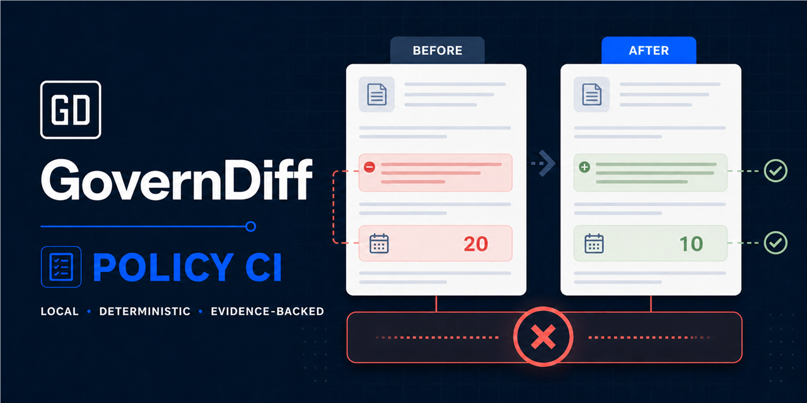

# GovernDiff in 30 seconds



**Policy CI for natural-language documents.** GovernDiff detects review-worthy
changes in PDF, DOCX, HTML, Markdown, and text locally and deterministically,
before they merge.

## See the result first

Three synthetic cases are ready to inspect without uploading a document:

| Scenario | Policy change | GovernDiff signal | Self-contained report |
|---|---|---|---|
| Incident deadline | Optional 72-hour notice becomes a mandatory 24-hour deadline | `modality-strengthened`, `deadline-shortened` | [Open HTML](assets/demo-incident-deadline.html) |
| Access scope | Access expands from approved employees to employees and contractors | `scope-expanded` | [Open HTML](assets/demo-access-scope.html) |
| Exception and authority | Approval moves to a committee and a monetary exception is added | `authority-shifted`, `exception-added` | [Open HTML](assets/demo-exception-authority.html) |

The first case also has a generated GitHub Action-style evidence bundle:

- [Job Summary](assets/action-demo/summary.md)
- [Action manifest](assets/action-demo/manifest.json)
- JSON, Markdown, self-contained HTML, and CSV reports under
  `assets/action-demo/reports/`

## Run the synthetic example

From a public source checkout:

```bash
python -m pip install .
governdiff diff \
  examples/public-cases/01-incident-deadline/old.md \
  examples/public-cases/01-incident-deadline/new.md \
  --format html --output report.html
```

Expected result: one modified change and two high-confidence Breaking cues. The
deadline changes from 72 hours to 24 hours, and permissive language becomes
mandatory.

Start the local review loop:

```bash
governdiff review \
  examples/public-cases/01-incident-deadline/old.md \
  examples/public-cases/01-incident-deadline/new.md \
  --output-dir reviewed
```

The session binds to `127.0.0.1`, opens the packaged Reviewer, receives the
decision log, and writes final JSON, Markdown, HTML, and CSV reports.

## Add Policy CI to a pull request

After the approved Action tag exists:

```yaml
- uses: actions/checkout@v6
- uses: OWNER/governdiff@v1
  with:
    paths: |
      GOVERNANCE.md
      SECURITY.md
      policies/**/*.{md,pdf,docx,html,txt}
    min-confidence: medium
    fail-on-severity: high
```

The Action keeps the complete evidence artifact even when the gate blocks the
pull request.

## What this demo does not claim

- `Breaking` is a deterministic review cue, not legal advice or a compliance conclusion.
- OCR, URL import, remote AI, accounts, telemetry, and hosted document processing are not included.
- Current completed runtime verification is Windows-first; hosted macOS/Linux evidence remains a release-stage gate.
- All text and screenshots on this page are synthetic.
